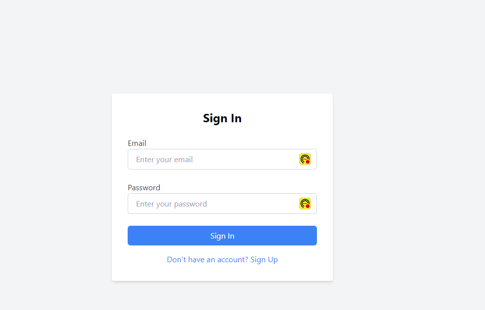
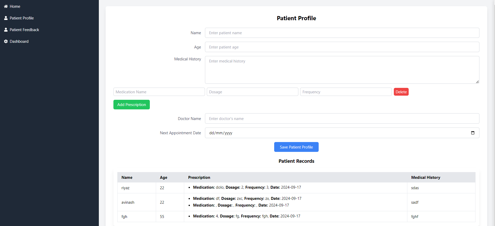
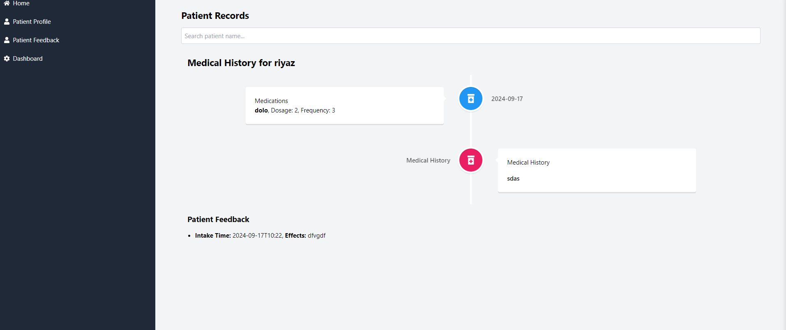
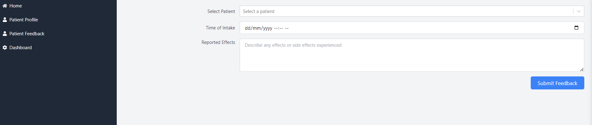

# Medical Follow Up System

## Project Overview

The Medical Follow Up System is a web application designed to manage patient profile, feedback and medical history. It allows users to submit feedback about medication, track medical history, and visualize it in a timeline format. The application is built with React for the frontend and Firebase for the backend.

## Features
- **Patient Management**: Select patients from a dynamic list and associate feedback with them.
- **Medical History Timeline**: View and manage patient medical history and prescriptions in a vertical timeline.
- **Feedback Form**: Submit feedback about medication intake, including time and reported effects.


## Setup Instructions

Follow these steps to set up the project on your local machine:

### Prerequisites

- Node.js (v18 or higher)
- npm 
- Firebase account

### Clone the Repository

```bash
git clone https://github.com/riyazpt/medical-follow-up.git
cd medical-follow-up
npm install
```
### Configure Firebase

- Go to the Firebase Console.
- Create a new Firebase project if you don't have one.
- Add a web app to your Firebase project and get your Firebase configuration.
- Set Up Environment Variables
- Create a .env file in the root of the project directory.
- Add your Firebase configuration to the .env file. It should look like this:

```bash
REACT_APP_FIREBASE_API_KEY=your_firebase_api_key
REACT_APP_FIREBASE_AUTH_DOMAIN=your_firebase_auth_domain
REACT_APP_FIREBASE_PROJECT_ID=your_firebase_project_id
REACT_APP_FIREBASE_STORAGE_BUCKET=your_firebase_storage_bucket
REACT_APP_FIREBASE_MESSAGING_SENDER_ID=your_firebase_messaging_sender_id
REACT_APP_FIREBASE_APP_ID=your_firebase_app_id
```
### Running the Project
```bash
 npm start
```
Navigate to http://localhost:3000 in your web browser to view the application

### Usage Instructions
1.  *Manage Patients*: Select patients from the dropdown list in the feedback form.
2. *View Medical History*: The Medical History section displays a timeline of patient appointments and prescriptions.
3. *Submit Feedback*: Use the feedback form to submit information about medication intake and effects.


### User Interfaces 
1. **Login**



2. **Profile**




3. **History**



3. **Feed Back**




